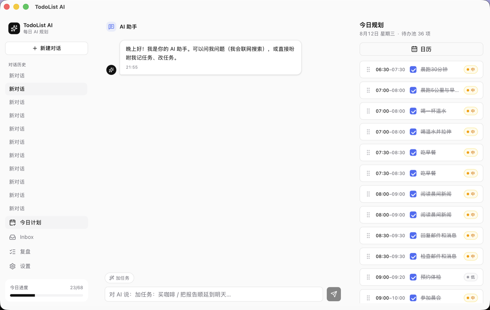
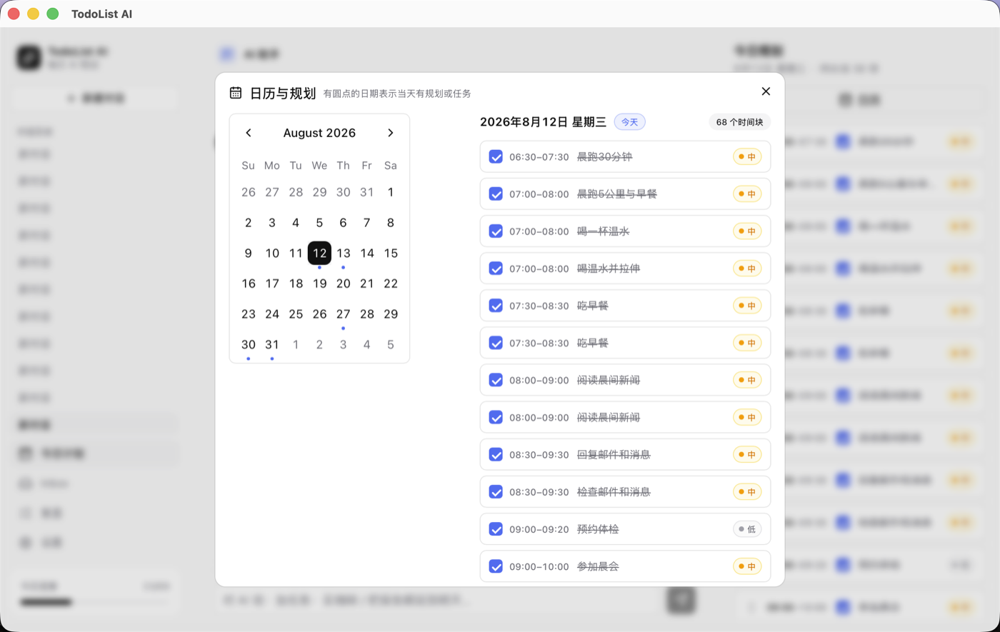
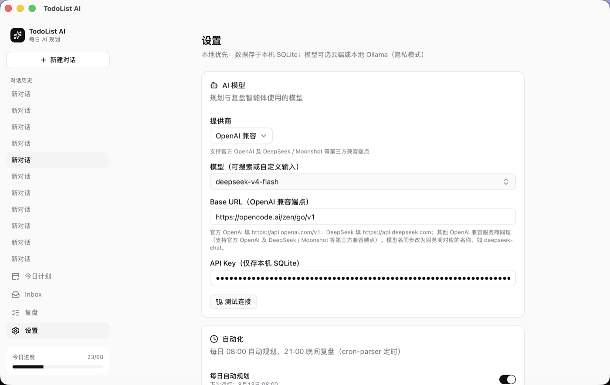

# TodoList AI

[](https://github.com/ezrayfranklin-commits/ToDoList-ai/releases/latest)

> **English**: [README.en.md](README.en.md) | **中文**: 本文档

这个项目是我自己一边用一边做的，还在慢慢长。你用下来碰到问题、有想法，或者想让它按你的方式工作，都可以找我聊。写邮件到 ezra.y.franklin@gmail.com 就行，GitHub 上开 issue、进 Discussion 也可以。一个人做的东西，最缺的就是有人告诉哪里不对。

一个跑在 macOS 上的 AI 待办应用。它跟普通待办软件的区别，是每天早上 8 点它会自己看一眼你手头的任务、日历和 Inbox，把今天要做的事排成时间块，等你点头。晚上 9 点再复盘一次，没做完的自动顺延到明天。

数据全在本机 SQLite 里。模型可以用云端，也可以全用本地 Ollama，什么都不往外发。

<p align="center">
  
</p>

## 它长什么样

首页顶部是一个 AI 助手。你直接跟它说人话，它就干活。

<p align="center">
  
</p>

日历上带圆点的日期，表示那天有规划或任务。点进去可以按天增删改查。

<p align="center">
  
</p>

设置页可以换模型提供商，填自己的 API Key，或者指到本地 Ollama。

## 能做什么

- **Inbox 随手记**。按 ⌘K 记一条，之后交给 AI 归类
- **对话式首页**。用自然语言说「加任务：买咖啡」「把 XX 顺延到明天」「完成 XX」，AI 直接改数据库；模型不可用时自动降级成关键词指令
- **每日自动规划**。08:00 自动生成今日计划，先出草稿，确认后写回任务
- **计划确认与调整**。拖拽排序时间块，增删任务
- **执行与跟踪**。勾选完成，看进度条
- **晚间复盘**。21:00 总结完成度，未完成自动顺延
- **联网搜索**。AI 回答会查 DuckDuckGo，失败自动回退 Google / Bing
- **本地优先**。SQLite 存数据，Ollama 隐私模式，不配置云端就不联网

## 下载安装

去 [Releases 页面](https://github.com/ezrayfranklin-commits/ToDoList-ai/releases/latest) 下载最新的 `dmg` 文件，打开后把 App 拖进应用程序。

目前发布的是 ad-hoc 签名包（没有 Apple 开发者证书），macOS 首次打开会提示「无法验证开发者」。右键点 App 选打开，或者运行一条命令放行。

```bash
xattr -cr "/Applications/TodoList AI.app"
```

## 快速开始

需要 Node.js、Rust 和 macOS。

```bash
npm install
npm run tauri dev    # 开发模式
npm run tauri build  # 打包 DMG
```

本地模型（推荐，隐私模式）

```bash
ollama serve
ollama pull qwen2.5:7b
```

然后在设置页把提供商切到 Ollama。

### 用云端模型

设置页的 Base URL 是开放的。官方 OpenAI 填 `https://api.openai.com/v1`，DeepSeek 填 `https://api.deepseek.com`，其他 OpenAI 兼容服务商同理。模型名可以自定义输入，比如 `deepseek-chat`、`deepseek-reasoner`、`gpt-4o-mini`。API Key 只存在本机 SQLite。

## 隐私说明

没有账号，没有广告，也不埋任何遥测 SDK。数据默认全在本机。

| 项 | 说明 |
|----|------|
| 本地数据 | SQLite 位于 `~/Library/Application Support/com.todolistai.app/todolist.db` |
| API Key | 只存本机 SQLite `settings` 表，明文，不上传 |
| `agent_runs` 日志 | 本机记录 AI 提示词和输出，只用于提示词迭代 |
| 云端模型 | 配置了云端提供商时，对话内容会发给对应服务商；用本地 Ollama 则完全不外发 |
| 联网搜索 | 搜索词发给 DuckDuckGo，失败回退 Google / Bing |
| 系统联动 | 通过 `remindctl` 读取 Apple 提醒事项，仅读取，需系统授权（开发中） |

代码里涉及隐私的位置都加了 `隐私:` 注释标注。

## 许可与商用限制

本项目采用 **PolyForm Noncommercial License 1.0.0**（见 `LICENSE`）。

- ✅ 允许个人学习、研究、自用、二次开发分享，公益组织、学校、科研机构、政府等非商业机构也可以使用
- ❌ 禁止商业变现。包括售卖本软件或衍生品、收费托管 / SaaS、把代码放进商业产品、商业培训和咨询

想商用，直接联系作者拿授权。

## 技术栈

| 层 | 选型 |
|----|------|
| 应用壳 | Tauri v2（Rust 后端只拼装官方插件） |
| 前端 | React 19 + Vite 7 + TypeScript + Tailwind CSS v4 |
| UI | shadcn/ui + lucide-react + dnd-kit + sonner |
| 状态 | Zustand + TanStack Query |
| 数据 | SQLite（tauri-plugin-sql）+ Drizzle |
| AI | Vercel AI SDK（OpenAI/Anthropic）+ 自研 Ollama 结构化生成器 |

## 测试

`tests/` 下有一套端到端测试，用真实模型跑 AI 的增删改查，每步独立直查数据库核对，不信任模型回复。

```bash
node tests/run-agent-crud.mjs
```

覆盖增、查、改、完成、删、防误删、防谎报、批量删、联网搜索，共 10 个用例。
